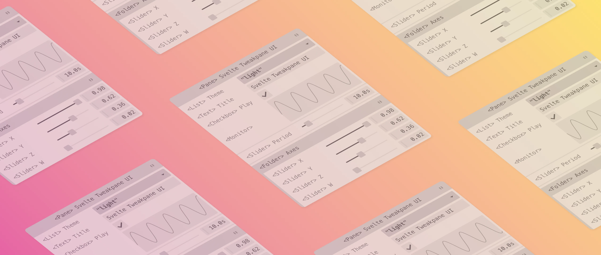

<!--+ Warning: Content inside HTML comment blocks was generated by mdat and may be overwritten. +-->

<!-- title -->

# svelte-tweakpane-ui

<!-- /title -->

<picture>
  <source media="(prefers-color-scheme: dark)" srcset="./assets/banner-dark.webp">
  
</picture>

<!-- badges {
  custom: {
    MadeWithSvelte: {
      image: "https://madewithsvelte.com/storage/repo-shields/4860-shield.svg",
      link: "https://madewithsvelte.com/p/svelte-tweakpane-ui/shield-link",
    },
    Documentation: {
      image:
        "https://img.shields.io/badge/-Documentation-ffdd00?logo=readthedocs&logoColor=222222",
      link: "https://kitschpatrol.com/svelte-tweakpane-ui",
    }
  }
} -->

[](https://npmjs.com/package/svelte-tweakpane-ui)
[](https://opensource.org/licenses/MIT)
[](https://madewithsvelte.com/p/svelte-tweakpane-ui/shield-link)
[](https://kitschpatrol.com/svelte-tweakpane-ui)

<!-- /badges -->

## Overview

🎛️ **_Svelte Tweakpane UI_** wraps user-interface elements from the excellent [Tweakpane](https://tweakpane.github.io/docs/) library in a collection of <!-- component-count -->31<!-- /component-count --> idiomatic, reactive, type-safe, carefully-crafted, and obsessively-documented [Svelte](https://svelte.dev) components.

The library makes it easy to quickly and declaratively add knobs and dials to your projects using components that feel like they were made for Svelte. It also augments Tweakpane with a few [extra features](https://kitschpatrol.com/svelte-tweakpane-ui/docs/features) for your convenience and enjoyment.

[The components](https://kitschpatrol.com/svelte-tweakpane-ui/docs#components) should be useful for integrating controls and value monitoring in parametrically driven artworks, data visualizations, creative tools, simulations, etc.

## Demo


## Documentation

**_Please see the documentation site for much more information:_**\
**<https://kitschpatrol.com/svelte-tweakpane-ui>**

## Quick start

1. Add _Svelte Tweakpane UI_ to your Svelte project:

```sh
npm install svelte-tweakpane-ui
```

2. Import and use Tweakpane components in your `.svelte` files:

```svelte
<script lang="ts">
  import { Button } from 'svelte-tweakpane-ui';
</script>

<Button on:click={() => alert('🎛️')} />
```

## Components

<!-- component-list -->

### Core

- **[Binding](https://kitschpatrol.com/svelte-tweakpane-ui/docs/components/binding)**\
  Wraps the Tweakpane [`addBinding`](https://tweakpane.github.io/docs/input-bindings/) method.
- **[Blade](https://kitschpatrol.com/svelte-tweakpane-ui/docs/components/blade)**\
  Wraps the Tweakpane [`addBlade`](https://tweakpane.github.io/docs/blades/) method.
- **[Folder](https://kitschpatrol.com/svelte-tweakpane-ui/docs/components/folder)**\
  Organize multiple controls into a collapsable folder.
- **[Pane](https://kitschpatrol.com/svelte-tweakpane-ui/docs/components/pane)**\
  The root `<Pane>` component, used for organizing controls into a single group and controlling how and where the Tweakpane is displayed.
- **[Separator](https://kitschpatrol.com/svelte-tweakpane-ui/docs/components/separator)**\
  A convenience component providing a subtle visual separator between controls, in the spirit of the HTML `<hr>` element.
- **[TabGroup](https://kitschpatrol.com/svelte-tweakpane-ui/docs/components/tabgroup)**\
  Contains a collection of `<TabPage>` components to be presented as a tabs.
- **[TabPage](https://kitschpatrol.com/svelte-tweakpane-ui/docs/components/tabpage)**\
  Contains a collection of Tweakpane controls to be presented as a single group inside a `<TabGroup>` component.

### Control

- **[Button](https://kitschpatrol.com/svelte-tweakpane-ui/docs/components/button)**\
  A humble but effective push button.
- **[ButtonGrid](https://kitschpatrol.com/svelte-tweakpane-ui/docs/components/buttongrid)**\
  A grid of `<Button>` components.
- **[Checkbox](https://kitschpatrol.com/svelte-tweakpane-ui/docs/components/checkbox)**\
  A checkbox.
- **[Color](https://kitschpatrol.com/svelte-tweakpane-ui/docs/components/color)**\
  A color picker.
- **[CubicBezier](https://kitschpatrol.com/svelte-tweakpane-ui/docs/components/cubicbezier)**\
  A control for editing a bezier curve. Ideal for tweaking animation easing values.
- **[Image](https://kitschpatrol.com/svelte-tweakpane-ui/docs/components/image)**\
  An image input control.
- **[IntervalSlider](https://kitschpatrol.com/svelte-tweakpane-ui/docs/components/intervalslider)**\
  A twin-handled slider control for specifying range values.
- **[List](https://kitschpatrol.com/svelte-tweakpane-ui/docs/components/list)**\
  An option list picker, similar to an HTML `<select>` element.
- **[Point](https://kitschpatrol.com/svelte-tweakpane-ui/docs/components/point)**\
  Wraps the Tweakpane [point bindings](https://tweakpane.github.io/docs/input-bindings/#point).
- **[RadioGrid](https://kitschpatrol.com/svelte-tweakpane-ui/docs/components/radiogrid)**\
  A grid of radio buttons.
- **[Ring](https://kitschpatrol.com/svelte-tweakpane-ui/docs/components/ring)**\
  A control evoking the focus ring on a proper camera lens.
- **[RotationEuler](https://kitschpatrol.com/svelte-tweakpane-ui/docs/components/rotationeuler)**\
  Integrates the [euler rotation](https://github.com/0b5vr/tweakpane-plugin-rotation/blob/dev/src/RotationInputPluginEuler.ts) control from [0b5vr](https://0b5vr.com)'s [tweakpane-plugin-rotation](https://github.com/0b5vr/tweakpane-plugin-rotation).
- **[RotationQuaternion](https://kitschpatrol.com/svelte-tweakpane-ui/docs/components/rotationquaternion)**\
  Integrates the [quaternion rotation](https://github.com/0b5vr/tweakpane-plugin-rotation/blob/dev/src/RotationInputPluginQuaternion.ts) control from [0b5vr](https://0b5vr.com)'s [tweakpane-plugin-rotation](https://github.com/0b5vr/tweakpane-plugin-rotation).
- **[Slider](https://kitschpatrol.com/svelte-tweakpane-ui/docs/components/slider)**\
  A slider component providing fine-grained control over numeric values.
- **[Text](https://kitschpatrol.com/svelte-tweakpane-ui/docs/components/text)**\
  A text field, in the spirit of the HTML `<input type="text">` element.
- **[Textarea](https://kitschpatrol.com/svelte-tweakpane-ui/docs/components/textarea)**\
  A multi-line text input field, in the spirit of the HTML `<textarea>` element.
- **[Wheel](https://kitschpatrol.com/svelte-tweakpane-ui/docs/components/wheel)**\
  A control evoking a dial on a proper camera body.

### Monitor

- **[FpsGraph](https://kitschpatrol.com/svelte-tweakpane-ui/docs/components/fpsgraph)**\
  A control for monitoring and graphing frame rates over time.
- **[Monitor](https://kitschpatrol.com/svelte-tweakpane-ui/docs/components/monitor)**\
  Wraps the Tweakpane [monitor binding](https://tweakpane.github.io/docs/monitor-bindings/) functionality for `boolean`, `number`, and `string` values.
- **[Profiler](https://kitschpatrol.com/svelte-tweakpane-ui/docs/components/profiler)**\
  Measure and visualize multiple quantities over time.
- **[WaveformMonitor](https://kitschpatrol.com/svelte-tweakpane-ui/docs/components/waveformmonitor)**\
  Visualize multiple numeric values as a waveform.

### Extra

- **[AutoObject](https://kitschpatrol.com/svelte-tweakpane-ui/docs/components/autoobject)**\
  Rapid-development component which automatically creates a set of Tweakpane controls for an arbitrary object.
- **[AutoValue](https://kitschpatrol.com/svelte-tweakpane-ui/docs/components/autovalue)**\
  Rapid-development component which automatically creates a Tweakpane control for an arbitrary value.
- **[Element](https://kitschpatrol.com/svelte-tweakpane-ui/docs/components/element)**\
  A component for embedding arbitrary HTML elements into a pane.

<!-- /component-list -->

## Maintainers

[@kitschpatrol](https://github.com/kitschpatrol)

## Acknowledgments

Thank you to [Hiroki Kokubun](https://cocopon.me) for creating the [Tweakpane](https://tweakpane.github.io/docs/) library.

Additional acknowledgments are listed [on the documentation site](https://kitschpatrol.com/svelte-tweakpane-ui/docs/acknowledgments).

<!-- footer -->

## Contributing

[Issues](https://github.com/kitschpatrol/svelte-tweakpane-ui/issues) and pull requests are welcome.

## License

[MIT](license.txt) © Eric Mika

<!-- /footer -->

---

_Note: This library is not to be confused with Karl Moore's [`svelte-tweakpane`](https://github.com/pierogis/svelte-tweakpane)._
