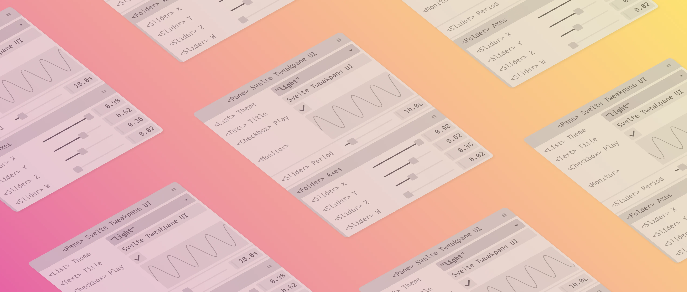

<!--+ Warning: Content inside HTML comment blocks was generated by mdat and may be overwritten. +-->

<!-- title -->

# svelte-tweakpane-ui

<!-- /title -->

<picture>
  <source media="(prefers-color-scheme: dark)" srcset="./assets/banner-dark.webp">
  
</picture>

<!-- badges {
  custom: {
    MadeWithSvelte: {
      image: "https://madewithsvelte.com/storage/repo-shields/4860-shield.svg",
      link: "https://madewithsvelte.com/p/svelte-tweakpane-ui/shield-link",
    },
    Documentation: {
      image:
        "https://img.shields.io/badge/-Documentation-ffdd00?logo=readthedocs&logoColor=222222",
      link: "https://kitschpatrol.com/svelte-tweakpane-ui",
    }
  }
} -->

[](https://npmjs.com/package/svelte-tweakpane-ui)
[](https://opensource.org/licenses/MIT)
[](https://madewithsvelte.com/p/svelte-tweakpane-ui/shield-link)
[](https://kitschpatrol.com/svelte-tweakpane-ui)

<!-- /badges -->

## Overview

🎛️ **_Svelte Tweakpane UI_** wraps user-interface elements from the excellent [Tweakpane](https://tweakpane.github.io/docs/) library in a collection of <!-- component-count -->33<!-- /component-count --> idiomatic, reactive, type-safe, carefully-crafted, and obsessively-documented [Svelte](https://svelte.dev) components.

The library makes it easy to quickly and declaratively add knobs and dials to your projects using components that feel like they were made for Svelte. It also augments Tweakpane with a few [extra features](https://kitschpatrol.com/svelte-tweakpane-ui/docs/features) for your convenience and enjoyment.

[The components](https://kitschpatrol.com/svelte-tweakpane-ui/docs#components) should be useful for integrating controls and value monitoring in parametrically driven artworks, data visualizations, creative tools, simulations, etc.

The library is compatible with both Svelte 4 and Svelte 5.

## Demo


## Documentation

**_Please see the documentation site for much more information:_**\
**<https://kitschpatrol.com/svelte-tweakpane-ui>**

## Quick start

1. Add _Svelte Tweakpane UI_ to your Svelte project:

```sh
npm install svelte-tweakpane-ui
```

2. Import and use Tweakpane components in your `.svelte` files:

```svelte
<script lang="ts">
  import { Button } from 'svelte-tweakpane-ui'
</script>

<Button on:click={() => alert('🎛️')} />
```

## Components

<!-- component-list -->

### Core

- **[Binding](https://kitschpatrol.com/svelte-tweakpane-ui/docs/components/binding)**\
  Wraps the Tweakpane [`addBinding`](https://tweakpane.github.io/docs/input-bindings/) method.

Important: This component is provided for consistency with Tweakpane's API, but is not recommended
for general use in _Svelte Tweakpane UI_ because more helpful abstractions are available.

Please consider convenience components like `<Slider>`, `<Color>`, etc. etc. before using this
component directly.

Usage outside of a `<Pane>` component will implicitly wrap the component in `<Pane
 position="inline">`.

- **[Blade](https://kitschpatrol.com/svelte-tweakpane-ui/docs/components/blade)**\
  Wraps the Tweakpane [`addBlade`](https://tweakpane.github.io/docs/blades/) method.

Important: This component is provided for consistency with Tweakpane's API, but is not recommended
for general use in _Svelte Tweakpane UI_ because more helpful abstractions are available.

Please consider convenience components like `<Separator>`, etc. before using this component
directly.

Usage outside of a `<Pane>` component will implicitly wrap the component in `<Pane
 position="inline">`.

Tweakpane's vanilla JS API offers Blades as as a way to create unbound components, but in Svelte the
same is achieved by simply not binding the component's value.

In the example, a `<Separator>` component would be preferred over `<Blade>`, and would  obviate the
need for the options param.

- **[Folder](https://kitschpatrol.com/svelte-tweakpane-ui/docs/components/folder)**\
  Organize multiple controls into a collapsable folder.

Wraps the Tweakpane [`addFolder`](https://tweakpane.github.io/docs/ui-components/#folder) method.

May also be used to label and group multiple controls without user-collapsibility by setting
`userExpandable` to `false` and `expanded` to true.

Usage outside of a `<Pane>` component will implicitly wrap the folder in `<Pane position="inline">`.

- **[Pane](https://kitschpatrol.com/svelte-tweakpane-ui/docs/components/pane)**\
  The root `<Pane>` component, used for organizing controls into a single group and controlling how
  and where the Tweakpane is displayed.

This component is a wrapper around Tweakpane's
[`Pane`](https://tweakpane.github.io/docs/api/classes/Pane.html) class.

Important: Unlike the vanilla JS Tweakpane API, wrapping components in a `<Pane>` is not mandatory.

Pane-less components will be automatically nested in a `<Pane position="inline">` component and
displayed in the regular block flow of the page. `<Pane>` is only necessary when you want to
explicitly group a number of components, or when you want convenient means to control how and where
the Tweakpane is shown on the page. (See an [important
exception](https://kitschpatrol.com/svelte-tweakpane-ui/docs#island-framework-compatibility)
regarding _Svelte Tweakpane UI_ in island frameworks like Astro.)

Multiple `<Pane>` components of different modes may be added to a single page. If the panes are in
`fixed` or `draggable` mode, you might want to set the `x` or `y` properties to prevent overlap.

Note that `<Pane>` is a dynamic component, and availability of additional props will vary depending
on the defined `position` value.

Position mode overview:

- **`<Pane position="draggable" ...>`**  \
  This is an extension of Tweakpane's core functionality, which reasonably considers pane dragging
  outside of the library's scope. See discussion in Tweakpane issues
  [#88](https://github.com/cocopon/tweakpane/issues/88) and
  [#301](https://github.com/cocopon/tweakpane/issues/301).\
  \
  By default, the pane's last position and width will be saved to the browser's local storage and
  re-applied across page reloads. (Set the `storePositionLocally` prop to false to prevent this.)\
  \
  If multiple `<Pane position="draggable" ...>` components are used on the same page with
  `storePositionLocally` set to true, then each must have a unique `localStoreId` prop set to avoid
  collisions.\
  \
  Double-clicking the width drag handle will expand or contract the pane between to its `minWidth`
  and `maxWidth` sizes.

- **`<Pane position="draggable-absolute" ...>`**  \
  Like `draggable`, but behaves as if absolutely positioned in the document: `x/y` are stored in
  document coordinates so the pane moves with the page while scrolling.\
  \
  Internally, the pane is rendered as `position: fixed` to avoid affecting layout or overflow, with its
  viewport coordinates converted to document coordinates using the current scroll position.

- **`<Pane position="inline" ...>`**  \
  Provides an inline version of the pane component, allowing the Tweakpane window to appear in the
  normal flow of the document.\
  \
  All other _Svelte Tweakpane UI_ components which are created without a containing `<Pane>` are
  nested implicitly inside a title-less `<Pane position="inline">` component. As such, you do not
  necessarily need create `<Pane position="inline">` components in most cases.\
  \
  This mode's behavior is similar to creating a Pane in the vanilla JS Tweakpane with its
  [`container`](https://tweakpane.github.io/docs/misc/#containerElement) property set to a specific
  element where you want the Pane to appear.

- **`<Pane position="fixed" ...>`**  \
  This mode uses the standard vanilla JS Tweakpane behavior of displaying in a fixed position over
  the top-right of the page.

- **[Separator](https://kitschpatrol.com/svelte-tweakpane-ui/docs/components/separator)**\
  A convenience component providing a subtle visual separator between controls, in the spirit of the
  HTML `<hr>` element.

Wraps Tweakpane's [separator blade](https://tweakpane.github.io/docs/blades/#separator).

Usage outside of a `<Pane>` component will implicitly wrap the separator in `<Pane
 position="inline">`.

- **[TabGroup](https://kitschpatrol.com/svelte-tweakpane-ui/docs/components/tabgroup)**\
  Contains a collection of `<TabPage>` components to be presented as a tabs.

Wrapper around Tweakpane's [`addTab`](https://tweakpane.github.io/docs/ui-components/#tab) method.

The name of this concept within the underlying vanilla JS Tweakpane API is `tab`, but it has been
changed to `TabGroup` in _Svelte Tweakpane UI_ to clarify it's relationship to the `<TabPage>`
component.

Usage outside of a `<Pane>` component will implicitly wrap the tab in `<Pane position="inline">`.

- **[TabPage](https://kitschpatrol.com/svelte-tweakpane-ui/docs/components/tabpage)**\
  Contains a collection of Tweakpane controls to be presented as a single group inside a `<TabGroup>`
  component.

Provides `page` values to Tweakpane's
[`addTab`](https://tweakpane.github.io/docs/ui-components/#tab) method.

The name of this concept within the underlying vanilla JS Tweakpane API is `page`, but it has been
changed to `TabPage` in _Svelte Tweakpane UI_ for clarity its relationship to the `<TabGroup>`
component.

Usage outside of a `<TabGroup>` component wouldn't make much sense, but in such cases the
`<TabPage>` will be implicitly wrapped in a `<TabGroup>` and `<Pane position="inline">`.

### Control

- **[Button](https://kitschpatrol.com/svelte-tweakpane-ui/docs/components/button)**\
  A humble but effective push button.

Wraps the Tweakpane [`addButton`](https://tweakpane.github.io/docs/ui-components/#button) method.

Usage outside of a `<Pane>` component will implicitly wrap the button in `<Pane position="inline">`.

See the `<ButtonGrid>` and `<RadioGrid>` components for a convenient way to lay out multiple
buttons.

- **[ButtonGrid](https://kitschpatrol.com/svelte-tweakpane-ui/docs/components/buttongrid)**\
  A grid of `<Button>` components.

Integrates the [Button Grid](https://github.com/tweakpane/plugin-essentials#button-grid) control
from Tweakpane-creator [Hiroki Kokubun's](https://cocopon.me)  [Essentials
plugin](https://github.com/tweakpane/plugin-essentials).

See `<RadioGrid>` for a radio-flavored variation.

_Svelte Tweakpane UI_ also includes some additional logic to manage default grid dimensions:

- If no `rows` or `columns` props are provided, it will create a grid with the squarest possible aspect ratio for the given quantity of `values`.

- If a single `rows` or `columns` prop is provided, it lets the undefined axis grow / shrink as needed to accommodate the quantity of `values`.

- If both `rows` _and_ `columns` props area provided, then buttons may be clipped if `rows * columns < values.length`.

Usage outside of a `<Pane>` component will implicitly wrap the button grid in `<Pane
 position="inline">`.

Note that _Svelte Tweakpane UI_ embeds a functionally identical [fork](https://github.com/kitschpatrol/tweakpane-plugin-essentials) of the plugin with build optimizations. The fork also changes the package name from `@tweakpane/plugin-essentials` to `@kitschpatrol/tweakpane-plugin-essentials` for consistency with other plugins.

- **[Checkbox](https://kitschpatrol.com/svelte-tweakpane-ui/docs/components/checkbox)**\
  A checkbox.

Wraps Tweakpane's [boolean input binding](https://tweakpane.github.io/docs/input-bindings/#boolean).

Usage outside of a `<Pane>` component will implicitly wrap the checkbox in `<Pane position="inline">`.

- **[Color](https://kitschpatrol.com/svelte-tweakpane-ui/docs/components/color)**\
  A color picker.

Wraps Tweakpane's [color input binding](https://tweakpane.github.io/docs/input-bindings/#color).

Usage outside of a `<Pane>` component will implicitly wrap the color picker in `<Pane
 position="inline">`.

- **[CubicBezier](https://kitschpatrol.com/svelte-tweakpane-ui/docs/components/cubicbezier)**\
  A control for editing a bezier curve. Ideal for tweaking animation easing values.

Integrates the [Cubic Bezier](https://github.com/tweakpane/plugin-essentials#cubic-bezier) control
from Tweakpane-creator [Hiroki Kokubun's](https://cocopon.me)  [Essentials
plugin](https://github.com/tweakpane/plugin-essentials).

_Svelte Tweakpane UI_ extends the original implementation to by supporting tuple values in addition
to object values.

A utility function `Utils.cubicBezierToEaseFunction()` is also provided to easily convert a cubic
bezier value to an easing function compatible with Svelte's built-in
[motion](https://svelte.dev/docs/svelte-motion),
[transition](https://svelte.dev/docs/svelte-transition), and
[animate](https://svelte.dev/docs/svelte-animate) modules.

Usage outside of a `<Pane>` component will implicitly wrap the cubic bezier control in `<Pane
 position="inline">`.

Note that _Svelte Tweakpane UI_ embeds a [fork](https://github.com/kitschpatrol/tweakpane-plugin-essentials) of the plugin with build optimizations and [a fix for a performance issue](https://github.com/tweakpane/plugin-essentials/pull/21). The fork also changes the package name from `@tweakpane/plugin-essentials` to `@kitschpatrol/tweakpane-plugin-essentials` for consistency with other plugins.

- **[File](https://kitschpatrol.com/svelte-tweakpane-ui/docs/components/file)**\
  A file input control.

_Important: This component has some rough edges, and should be considered experimental._

Integrates the [File Input](https://github.com/LuchoTurtle/tweakpane-plugin-file-import/blob/main/src/plugin.ts) control from [LuchoTurtle's](https://github.com/LuchoTurtle) [tweakpane-plugin-file-import](https://github.com/LuchoTurtle/tweakpane-plugin-file-import) plugin. Some of the control's parameter names have been changed for consistency with the `<Image>` CompositionEvent.

Use the `<Image>` control instead if you're working with images and want to see a thumbnail preview of the image.

There is currently a known bug where change events' `origin` values are sometimes incorrect. (This issue is limited to this component.)

Usage outside of a `<Pane>` component will implicitly wrap the image control in `<Pane position="inline">`.

Note that _Svelte Tweakpane UI_ embeds a functionally identical [fork](https://github.com/kitschpatrol/tweakpane-plugin-file-import) of the plugin with build optimizations.

- **[Image](https://kitschpatrol.com/svelte-tweakpane-ui/docs/components/image)**\
  An image input control.

_Important: This component has some rough edges, and should be considered experimental._

Integrates the [tweakpane-image-plugin](https://github.com/metehus/tweakpane-image-plugin),
incorporating work by [Florian Morel](http://ayamflow.fr), [Matheus
Dias](https://www.linkedin.com/in/matheusdbs/), [Palash Bansal](https://github.com/repalash), and
others.

Use the `<File>` control instead if you're working with other file types, or don't wish to display a thumbnail preview of an uploaded image.

There is currently a known bug where change events' `origin` values are sometimes incorrect. (This issue is limited to this component.)

Usage outside of a `<Pane>` component will implicitly wrap the image control in `<Pane
 position="inline">`.

Note that _Svelte Tweakpane UI_ embeds a functionally identical [fork](https://github.com/kitschpatrol/tweakpane-plugin-image) of the plugin with build optimizations. The fork also changes the package name to `@kitschpatrol/tweakpane-plugin-image` for consistency with other plugins.

- **[IntervalSlider](https://kitschpatrol.com/svelte-tweakpane-ui/docs/components/intervalslider)**\
  A twin-handled slider control for specifying range values.

Integrates the [Interval](https://github.com/tweakpane/plugin-essentials#interval) control from
Tweakpane-creator [Hiroki Kokubun's](https://cocopon.me)  [Essentials
plugin](https://github.com/tweakpane/plugin-essentials).

_Svelte Tweakpane UI_ extends the original implementation to by supporting tuple values in addition
to object values. It also exposes a `meanValue` prop for reading or setting the midpoint of the
interval range value.

Usage outside of a `<Pane>` component will implicitly wrap the interval slider in `<Pane
 position="inline">`.

Note that _Svelte Tweakpane UI_ embeds a functionally identical [fork](https://github.com/kitschpatrol/tweakpane-plugin-essentials) of the plugin with build optimizations. The fork also changes the package name from `@tweakpane/plugin-essentials` to `@kitschpatrol/tweakpane-plugin-essentials` for consistency with other plugins.

- **[List](https://kitschpatrol.com/svelte-tweakpane-ui/docs/components/list)**\
  An option list picker, similar to an HTML `<select>` element.

Wraps Tweakpane's list blade. See Tweakpane's documentation for [list
blades](https://tweakpane.github.io/docs/blades/#list).

_Svelte Tweakpane UI_ extends Tweakpane's underlying implementation to allow for arbitrary arrays of
values to be used as options. See the `ListOptions` type for details on how to provide specific
labels to options.

Tweakpane's `addBlade` list variations is used instead of the `addBinding` method to allow for
additional value types. The `value` remains bindable via Svelte's reactivity.

Usage outside of a `<Pane>` component will implicitly wrap the color picker in `<Pane
 position="inline">`.

- **[Point](https://kitschpatrol.com/svelte-tweakpane-ui/docs/components/point)**\
  Wraps the Tweakpane [point bindings](https://tweakpane.github.io/docs/input-bindings/#point).

Provides a nice cartesian picker for 2D points, and numeric input fields for 3D and 4D points. See
the `<RotationEuler>` and `<RotationQuaternion>` components for higher-dimension graphical pickers.

Extends the vanilla JS Tweakpane APIs to also support tuple values. (Useful when working with
frameworks like [three.js](https://threejs.org) / [threlte](https://threlte.xyz).)

`<Point>` is a dynamic component, and the availability of the `optionsZ` and `optionsW` props will
change depending on the number of dimensions in the `value`.

Usage outside of a `<Pane>` component will implicitly wrap the point picker in a `<Pane
 position="inline">` component.

- **[RadioGrid](https://kitschpatrol.com/svelte-tweakpane-ui/docs/components/radiogrid)**\
  A grid of radio buttons.

Integrates the [Radio Grid](https://github.com/tweakpane/plugin-essentials#radio-grid) control from
Tweakpane-creator [Hiroki Kokubun's](https://cocopon.me)  [Essentials
plugin](https://github.com/tweakpane/plugin-essentials).

See `<ButtonGrid>` for a button-flavored variation.

Unlike the vanilla Tweakpane API, _Svelte Tweakpane UI_ provides a unique `groupname` for each
instance of RadioGrid by default for consistency with expectations around component isolation. You
may still assign the `groupname` prop manually to create cross-component groups that share selection
exclusivity.

_Svelte Tweakpane UI_ also includes some additional logic to manage default grid dimensions:

- If no `rows` or `columns` props are provided, it will create a grid with the squarest possible aspect ratio for the given quantity of `values`.

- If a single `rows` or `columns` prop is provided, it lets the undefined axis grow / shrink as needed to accommodate the quantity of `values`.

- If both `rows` _and_ `columns` props area provided, then buttons may be clipped if `rows * columns < values.length`.

Usage outside of a `<Pane>` component will implicitly wrap the radio grid in `<Pane
 position="inline">`.

Note that _Svelte Tweakpane UI_ embeds a functionally identical [fork](https://github.com/kitschpatrol/tweakpane-plugin-essentials) of the plugin with build optimizations. The fork also changes the package name from `@tweakpane/plugin-essentials` to `@kitschpatrol/tweakpane-plugin-essentials` for consistency with other plugins.

- **[Ring](https://kitschpatrol.com/svelte-tweakpane-ui/docs/components/ring)**\
  A control evoking the focus ring on a proper camera lens.

Similar in functionality to a `<Slider>`.

Integrates the [Ring](https://github.com/tweakpane/plugin-camerakit/blob/main/src/plugin-ring.ts)
control from Tweakpane-creator [Hiroki Kokubun's](https://cocopon.me) [CameraKit
plugin](https://github.com/tweakpane/plugin-camerakit).

Usage outside of a `<Pane>` component will implicitly wrap the ring in `<Pane position="inline">`.

Note that _Svelte Tweakpane UI_ embeds a functionally identical [fork](https://github.com/kitschpatrol/tweakpane-plugin-camerakit) of the plugin with build optimizations. The fork also changes the package name from `@tweakpane/plugin-camerakit` to `@kitschpatrol/tweakpane-plugin-camerakit` for consistency with other plugins.

- **[RotationEuler](https://kitschpatrol.com/svelte-tweakpane-ui/docs/components/rotationeuler)**\
  Integrates the [euler
  rotation](https://github.com/0b5vr/tweakpane-plugin-rotation/blob/dev/src/RotationInputPluginEuler.ts)
  control from [0b5vr](https://0b5vr.com)'s [tweakpane-plugin-rotation](https://github.com/0b5vr/tweakpane-plugin-rotation).

_Svelte Tweakpane UI_ extends the original API to support tuple values in addition to object values.
(Useful when working with frameworks like [three.js](https://threejs.org) /
[threlte](https://threlte.xyz).)

A utility function `Utils.eulerToCssTransform()` is also provided to easily convert a quaternion
value object or tuple into a CSS transform string.

See also `<RotationQuaternion>` if you're feeling gimbal locked.

Usage outside of a `<Pane>` component will implicitly wrap the profiler in `<Pane
 position="inline">`.

Note that _Svelte Tweakpane UI_ embeds a functionally identical [fork](https://github.com/kitschpatrol/tweakpane-plugin-rotation) of the plugin with build optimizations.

- **[RotationQuaternion](https://kitschpatrol.com/svelte-tweakpane-ui/docs/components/rotationquaternion)**\
  Integrates the [quaternion
  rotation](https://github.com/0b5vr/tweakpane-plugin-rotation/blob/dev/src/RotationInputPluginQuaternion.ts)
  control from [0b5vr](https://0b5vr.com)'s [tweakpane-plugin-rotation](https://github.com/0b5vr/tweakpane-plugin-rotation).

_Svelte Tweakpane UI_ extends the original API to support tuple values in addition to object values.
(Useful when working with frameworks like [three.js](https://threejs.org) /
[threlte](https://threlte.xyz).)

A utility function `Utils.quaternionToCssTransform()` is also provided to easily convert a euler
rotation value object or tuple into a CSS transform string.

See also `<RotationEuler>` if you're not into the whole `w` thing.

Usage outside of a `<Pane>` component will implicitly wrap the profiler in `<Pane
 position="inline">`.

Note that _Svelte Tweakpane UI_ embeds a functionally identical [fork](https://github.com/kitschpatrol/tweakpane-plugin-rotation) of the plugin with build optimizations.

- **[Slider](https://kitschpatrol.com/svelte-tweakpane-ui/docs/components/slider)**\
  A slider component providing fine-grained control over numeric values.

Wraps Tweakpane's [number bindings](https://tweakpane.github.io/docs/input-bindings/#number).

Note that if `min` and `max` props are not defined, no linear slider widget will be provided and a
input field with a draggable handle will be used instead.

See the `<Interval>` component for a multi-handle range-defining slider.

Usage outside of a `<Pane>` component will implicitly wrap the slider in `<Pane position="inline">`.

- **[Stepper](https://kitschpatrol.com/svelte-tweakpane-ui/docs/components/stepper)**\
  A control for simple incremental value changes.

Similar in functionality to a `<Slider>`, but with nice big buttons to increment and decrement the value.

Integrates the [Stepper](https://github.com/tallneil/tweakpane-plugin-inputs/blob/main/src/stepper/plugin.ts)
control from [Neil Shankar's](https://tallneil.io/) ["Inputs for Tweakpane
" plugin](https://github.com/tallneil/tweakpane-plugin-inputs).

Usage outside of a `<Pane>` component will implicitly wrap the stepper in `<Pane position="inline">`.

Note that _Svelte Tweakpane UI_ embeds a functionally identical [fork](https://github.com/kitschpatrol/tweakpane-plugin-inputs) of the plugin with build optimizations.

- **[Text](https://kitschpatrol.com/svelte-tweakpane-ui/docs/components/text)**\
  A text field, in the spirit of the HTML `<input type="text">` element.

Wraps Tweakpane's [string binding](https://tweakpane.github.io/docs/input-bindings/#string).

Extends the vanilla JS Tweakpane API to update the bound value on every keystroke. (If you prefer
Tweakpane's default behavior of only updating on blur, set `live={false}`.)

See `<TextArea>` for a multi-line input variation.

Usage outside of a `<Pane>` component will implicitly wrap the text field in `<Pane
 position="inline">`.

- **[Textarea](https://kitschpatrol.com/svelte-tweakpane-ui/docs/components/textarea)**\
  A multi-line text input field, in the spirit of the HTML `<textarea>`
  element.

Integrates the
[tweakpane-textarea-plugin](https://github.com/panGenerator/tweakpane-textarea-plugin)
by [Krzysztof Goliński](http://www.golinski.org) and [Jakub
Koźniewski](https://pangenerator.com).

Extends the underlying implementation with the `live` property to match the
behavior of the `<Text>` component.

Usage outside of a `<Pane>` component will implicitly wrap the text area in
`<Pane position="inline">`.

Note that _Svelte Tweakpane UI_ embeds a functionally identical [fork](https://github.com/kitschpatrol/tweakpane-plugin-textarea) of the plugin with build optimizations. The fork also changes the package name from `@pangenerator/tweakpane-textarea-plugin` to `@kitschpatrol/tweakpane-plugin-textarea` for consistency with other plugins.

- **[Wheel](https://kitschpatrol.com/svelte-tweakpane-ui/docs/components/wheel)**\
  A control evoking a dial on a proper camera body.

Similar in functionality to a `<Slider>`.

Integrates the [Wheel](https://github.com/tweakpane/plugin-camerakit/blob/main/src/plugin-wheel.ts)
control from Tweakpane-creator [Hiroki Kokubun's](https://cocopon.me) [CameraKit
plugin](https://github.com/tweakpane/plugin-camerakit).

Usage outside of a `<Pane>` component will implicitly wrap the wheel in `<Pane position="inline">`.

Note that _Svelte Tweakpane UI_ embeds a functionally identical [fork](https://github.com/kitschpatrol/tweakpane-plugin-camerakit) of the plugin with build optimizations. The fork also changes the package name from `@tweakpane/plugin-camerakit` to `@kitschpatrol/tweakpane-plugin-camerakit` for consistency with other plugins.

### Monitor

- **[FpsGraph](https://kitschpatrol.com/svelte-tweakpane-ui/docs/components/fpsgraph)**\
  A control for monitoring and graphing frame rates over time.

Integrates the [FPS Graph](https://github.com/tweakpane/plugin-essentials#fps-graph) control from
Tweakpane-creator [Hiroki Kokubun's](https://cocopon.me)  [Essentials
plugin](https://github.com/tweakpane/plugin-essentials).

By default, the component creates an internal `requestAnimationFrame` loop to measure the overall
performance of the page. If you want to measure the performance of a specific block of code, you can
bind the `begin` and `end` props for access to functions to fence the code of interest. (The default
internal loop will be cleaned up automatically on the bound functions first use.)

See the `<Profiler>` component for a more advanced measurement and visualization strategies.

If you'd like to observe or visualize the frame rate data elsewhere, a `change` event is provided to
notify when the FPS value changes.

Usage outside of a `<Pane>` component will implicitly wrap the FPS graph in `<Pane
 position="inline">`.

Note that _Svelte Tweakpane UI_ embeds a functionally identical [fork](https://github.com/kitschpatrol/tweakpane-plugin-essentials) of the plugin with build optimizations. The fork also changes the package name from `@tweakpane/plugin-essentials` to `@kitschpatrol/tweakpane-plugin-essentials` for consistency with other plugins.

- **[Monitor](https://kitschpatrol.com/svelte-tweakpane-ui/docs/components/monitor)**\
  Wraps the Tweakpane [monitor binding](https://tweakpane.github.io/docs/monitor-bindings/)
  functionality for `boolean`, `number`, and `string` values.

Technically, any unbound value on a normal _Svelte Tweakpane UI_ component effectively acts as a
monitor, but additional monitor-specific components are provided to expose additional view options
(e.g. `rows`).

`<Monitor>` is a dynamic component, and the availability of additional props will vary depending on
the type of the defined `value`

Note that `interval` is not exposed on `boolean` and `string` monitors because updates are driven by
reactive changes in the `value`.

However, `interval` _is_ exposed on `number` monitors Note to allow independent control over the
reactive value's update rate and the graph's update rate.

See also the `<Waveform>` component for a more advanced number visualization.

Usage outside of a `<Pane>` component will implicitly wrap the monitor in a `<Pane
 position="inline">` component.

- **[Profiler](https://kitschpatrol.com/svelte-tweakpane-ui/docs/components/profiler)**\
  Measure and visualize multiple quantities over time.

Configured to measure a function's execution duration by default, but can be customized to measure
anything.

Integrates [0b5vr's](https://0b5vr.com)
[tweakpane-plugin-profiler](https://github.com/0b5vr/tweakpane-plugin-profiler).

See `<FpsGraph>` for a simpler alternative optimized for framerate visualization.

Usage outside of a `<Pane>` component will implicitly wrap the profiler in `<Pane
 position="inline">`.

Note that _Svelte Tweakpane UI_ embeds a functionally identical [fork](https://github.com/kitschpatrol/tweakpane-plugin-profiler) of the plugin with build optimizations.

- **[WaveformMonitor](https://kitschpatrol.com/svelte-tweakpane-ui/docs/components/waveformmonitor)**\
  Visualize multiple numeric values as a waveform.

Integrates [Simon Schödler's](https://shoedler.github.io)
[tweakpane-plugin-waveform](https://github.com/shoedler/tweakpane-plugin-waveform).

See `<Monitor>` component if you want to graph a single value's change over time.

Usage outside of a `<Pane>` component will implicitly wrap the waveform monitor in `<Pane
 position="inline">`.

Note that _Svelte Tweakpane UI_ embeds a functionally identical [fork](https://github.com/kitschpatrol/tweakpane-plugin-waveform) of the plugin with build optimizations.

### Extra

- **[AutoObject](https://kitschpatrol.com/svelte-tweakpane-ui/docs/components/autoobject)**\
  Rapid-development component which automatically creates a set of Tweakpane controls for an arbitrary
  object.

Object keys will be used as labels, and a (reasonably) appropriate Tweakpane control will be used
for each value's type.

Values are generally mapped to controls according to the logic outlined in the [Tweakpane input
binding documentation](https://tweakpane.github.io/docs/input-bindings/).

This component is intended for quick tests where you want "best guess" non-customizable controls for
an entire object, without considering the ideal component for each value.

See `<AutoValue>` for a variation that works directly on a stand-alone value that isn't wrapped in
an object.

Records within the object will wrap their contents in a `<Folder>` component. Value objects in the
shape of color or point objects will show a more specialized control.

Usage outside of a `<Pane>` component will implicitly wrap the component in `<Pane
 position="inline">`.

`<AutoObject>` was inspired by the
[`<TWPAutoMutable>`](https://github.com/0x241F31/solid-tweakpane/blob/master/src/automutable.tsx)
component in [Dmitriy Nikiforov's](https://github.com/0x241F31)
[solid-tweakpane](https://github.com/0x241F31/solid-tweakpane) library.

Plugin component behavior is not available in `<AutoObject>`.

- **[AutoValue](https://kitschpatrol.com/svelte-tweakpane-ui/docs/components/autovalue)**\
  Rapid-development component which automatically creates a Tweakpane control for an arbitrary value.

A (reasonably) appropriate Tweakpane control will be used for the value type.

This component is intended for quick tests where you don't want to fuss with component selection or
customization.

See `<AutoObject>` for a variation that creates controls for multiple values in an object.

The value is generally mapped to controls according to the logic outlined in the [Tweakpane input
binding documentation](https://tweakpane.github.io/docs/input-bindings/).

Plugin component behavior is not available in `<AutoValue>`.

- **[Element](https://kitschpatrol.com/svelte-tweakpane-ui/docs/components/element)**\
  A component for embedding arbitrary HTML elements into a pane.

Any children wrapped in this component will be rendered into the pane. Any
content larger than the pane in the horizontal axis will be clipped.

Useful for quickly prototyping UIs, or adding content to a pane that's not
easily represented by the built-in components.

This component does not have a direct analog in the vanilla Tweakpane universe.

Think of `<Element>` as an escape hatch for getting something into the pane that
you couldn't otherwise. Generally, it's recommended to abstract new
functionality for reuse by extending one of the internal component types in
Svelte Tweakpane UI, or better yet by creating a new [Tweakpane
Plugin](https://github.com/tweakpane/plugin-template) — but sometimes you just
need to get something into the pane quickly.

In many cases, this component should not be necessary because _Svelte Tweakpane
UI_ already makes it easy to combine tweakpane components with other inline
elements simply by using stand-alone components or a `<Pane position="inline">`
component. `<Element>` should generally be the most useful when you're using
`<Pane position="draggable">` or `<Pane position="fixed">` and you want a custom
element embedded in the pane.

Usage outside of a `<Pane>` component doesn't make a ton of sense, but in such a
case the `<Element>` will be implicitly wrapped in `<Pane position="inline">`.

<!-- /component-list -->

## Maintainers

[@kitschpatrol](https://github.com/kitschpatrol)

## Acknowledgments

Thank you to [Hiroki Kokubun](https://cocopon.me) for creating the [Tweakpane](https://tweakpane.github.io/docs/) library.

Additional acknowledgments are listed [on the documentation site](https://kitschpatrol.com/svelte-tweakpane-ui/docs/acknowledgments).

<!-- footer -->

## Contributing

[Issues](https://github.com/kitschpatrol/svelte-tweakpane-ui/issues) and pull requests are welcome.

## License

[MIT](license.txt) © Eric Mika

<!-- /footer -->

---

_Note: This library is not to be confused with Karl Moore's [`svelte-tweakpane`](https://github.com/pierogis/svelte-tweakpane)._
